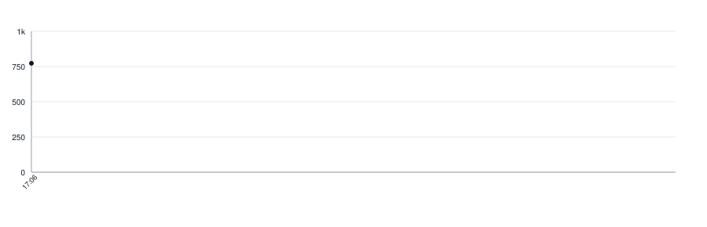

[](https://github.com/botforge-pro/lettermark-swift/actions/workflows/tests.yml)
[](https://botforge-pro.github.io/lettermark-swift/documentation/lettermark/)

# lettermark-swift

The mark a thing gets when it has no picture of its own: the letters that go in
the square, and which of the palette's colour slots it is drawn on.

```swift
import Lettermark

let letters = Lettermark.initials(of: name)

let marks = Palette(slots: 12)  // however many colours your theme paints
let slot = marks.slot(for: id)  // 0 … marks.slots - 1
```

The palette is not here, and neither is its size. A caller keeps its own — a
colour catalogue, a theme, a set of custom properties — and says how many
colours are in it when it builds the palette. That keeps one thing in one
place: the rule here, the colours where the rest of the design lives, the count
beside them.

Build it once, with the rest of your setup. A count below 1 stops the program,
because a palette that paints nothing means the code and the theme disagree,
and the place to hear that is startup rather than the middle of a screen.

The same id always answers the same slot, so a thing keeps its colour between
screens and between runs — for as long as the palette holds the same number of
colours. Painting one more or one fewer moves almost everything to a different
colour, which readers notice.

`initials(of:)` is given the name a reader sees. A caller holding markup strips
it first; this library does not know what markup its caller writes.

## Installation

```swift
dependencies: [
    .package(url: "https://github.com/botforge-pro/lettermark-swift", from: "0.2.0")
]
```

## Ports

This is the Swift port of [lettermark](https://github.com/botforge-pro/lettermark),
the Go repository the ports follow.

- Go — [lettermark](https://github.com/botforge-pro/lettermark)
- Swift — this repository
- Kotlin — [lettermark-kotlin](https://github.com/botforge-pro/lettermark-kotlin)

`cases.yaml` is the contract. It lives in the leading repository, this port
carries a copy under `Tests/LettermarkTests/Resources`, and a test compares
that copy with the leading repository byte for byte, so a case added there is
answered here or fails loudly. `make sync-corpus` brings a fresh copy over.

## Lines of Code

<picture>
  <source media="(prefers-color-scheme: dark)" srcset=".github/loc-history-dark.svg">
  <source media="(prefers-color-scheme: light)" srcset=".github/loc-history-light.svg">
  
</picture>
